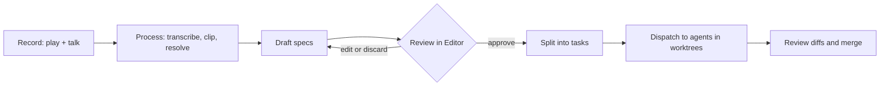
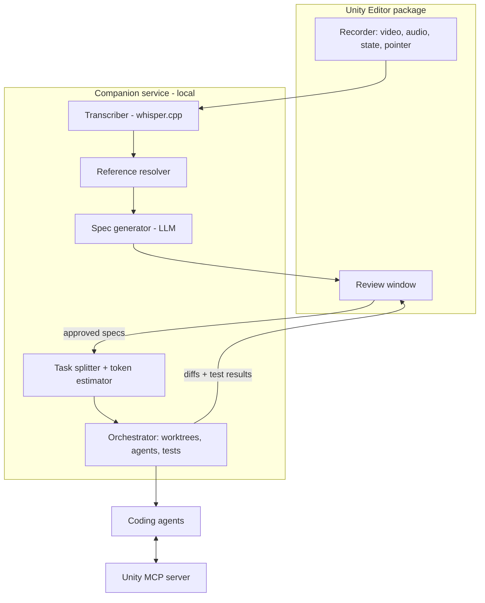
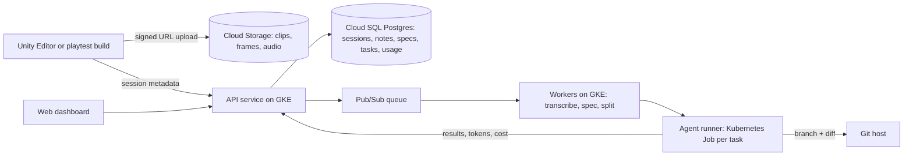

# Playtest Copilot for Unity: Product Spec

Exported Sep 28, 2026. Author: Spencer J Park.
The living version of this spec is at https://claude.ai/code/artifact/ee2f031b-a04a-402e-9556-8ee1363c472b

## Overview

Playtest Copilot turns a spoken playtest session in the Unity Editor into reviewed, agent-ready change specs, cutting the loop from "that feels wrong" to a working change from days to hours.

**Problem.** Playtest feedback is lossy. Notes like "jump feels floaty" lose the context of what was happening: which object, which frame, what the player was doing. Turning notes into tasks is manual, and AI coding agents given vague notes produce vague changes.

**Vision.** You press AI Play and talk. The tool records gameplay, your voice and a lightweight log of game state. Each remark is tied to the exact moment and the objects involved, then turned into a structured spec. After you review it, the spec is split into small, isolated tasks that coding agents can run in parallel.

**Target users.**

- Solo and indie Unity developers who already use AI coding agents
- Small teams where designers give feedback and engineers implement it
- Game jam teams iterating quickly on feel and tuning

## Goals and non-goals

The product succeeds when a spoken note becomes a correct, merged change without the developer rewriting the spec.

**Goals**

1. Capture every spoken note with its timestamp, a video clip and a game-state snapshot.
2. Resolve vague references ("this", "that enemy", "here") to specific GameObjects, prefabs and scripts.
3. Produce specs a coding agent can act on without follow-up questions.
4. Split approved specs into tasks that fit a context budget: target under 100k tokens, hard cap 150k.
5. Keep parallel tasks free of merge conflicts, especially on scenes and prefabs.

**Non-goals (v1)**

- Running without a human review step before code changes
- Building its own coding agent; it hands off to existing ones (Claude Code and similar)
- Multiplayer or on-device (phone, console) playtest capture
- Automatic balancing or design decisions without a spoken request

**Success metrics**

| Metric | Target for v1 |
| --- | --- |
| Notes with a correctly resolved object reference | 80% or more |
| Specs approved without edits | 60% or more |
| Agent tasks merged without manual conflict fixes | 90% or more |
| Time from end of playtest to first agent task running | Under 10 minutes |

## Editor experience

AI playtesting starts from its own **AI Play** button beside Unity's Play button, so normal Play is never slowed down by recording.

**AI Play button**

- Icon: a play triangle with an orange plus in the lower right, in the Editor's grey for normal and pro skins (`PlayAI.png` and `d_PlayAI.png`, 16 px and 32 px). Files are in `unity-package/Editor/Icons/`.
- Placement: next to Play/Pause/Step in the main toolbar, using Unity's main toolbar extension API where the Editor version has one, and a reflection-based toolbar injection otherwise.
- Pressing it enters play mode with capture on; the button stays highlighted while recording. Pressing normal Play gives a plain play session with no capture.
- Stopping play (either button) ends the session and starts processing.
- Right-click opens settings: voice mode (push-to-talk or always-on), rebindable record key, capture resolution, state backends (GameObject, Entities), and the session folder location.

**Pause and draw**

1. While in AI Play, press Pause or the annotate hotkey (default: F2). Time stops and the game view freezes.
2. An overlay appears on the game view with pen, circle, arrow and eraser tools. Circle is the default: drag to draw.
3. Talk while drawing, or type a short note in the overlay.
4. Press Done (or Enter). The tool saves the frozen frame, the drawing on its own layer and a combined image, then resumes play.

Each drawing also improves "this" resolution: objects inside the circle are found with screen-to-world raycasts across the circled area and ranked above other candidates. For Entities, the same raycasts run against the physics collision world.

**Session folder (everything on disk, readable by hand)**

All context goes to one folder per session, in plain files you can open without the tool:

```
PlaytestSessions/
  2026-09-28_1808_Level1/
    session.json          # Unity version, scene, settings, git commit
    audio.wav             # full microphone recording
    transcript.md         # full transcript with timestamps
    state.jsonl           # game state log
    notes/
      note_014/
        note.json         # transcript, references, state snapshot
        clip.mp4          # 5 s before to 5 s after
        frame.png         # frame at the moment of the note
        annotation.png    # drawing only, transparent
        annotated.png     # frame + drawing combined
        references.md     # resolved objects, paths, scripts
    specs/
      SPEC-007.md         # draft or approved spec
    tasks/
      SPEC-007-a.md       # task sent to an agent, owned files
    index.md              # one page linking every note and spec
```

- Default location is `Assets/PlaytestSessions/`, git-ignored; it can point anywhere in settings.
  (Changed from the project root on 2026-10-01: a folder outside `Assets/` never appears in the
  Project window, so sessions could not be seen or managed from inside the Editor.)
- `index.md` is a readable summary with thumbnails, so you can review a session without Unity open.
- The review window has an **Open Folder** button for each note and session.

## User flow

A session has five stages; the only required human step is reviewing specs before dispatch.



1. **Record.** Press AI Play. Pause and circle things on screen whenever words aren't enough. Hold a push-to-talk key (default: backtick, rebindable) or switch to always-on mode with voice activity detection. The tool warns if the record key clashes with a game input binding, and an on-screen record button is available instead. Each utterance drops a marker.
2. **Process.** When play mode ends, the tool transcribes audio, cuts a clip around each marker (5 s before to 5 s after the utterance) and resolves what each note refers to.
3. **Draft specs.** An LLM groups related notes ("jump is floaty" + "make falling faster" become one spec), classifies each (bug, tuning, feature, content) and writes a spec.
4. **Review.** An Editor window shows each spec beside its clip, transcript and linked objects. You approve, edit, merge, split or discard.
5. **Dispatch.** Approved specs are split into tasks within the token budget, each given its own git worktree and a set of owned files. Results come back as diffs for review.

## Capture pipeline

Capture records four streams on one shared clock (`Time.realtimeSinceStartup` plus frame count), so any spoken word can be matched to a frame and a game state.

| Stream | What is recorded | How | Rough cost |
| --- | --- | --- | --- |
| Video | Game view at 720p, 30 fps | Unity Recorder API or a render-texture encoder | ~1-2 GB per hour before trimming; only clips are kept |
| Audio | Microphone, 16 kHz mono | `Microphone` class, ring buffer written to WAV | ~115 MB per hour |
| State log | Snapshots every 0.25 s plus event-driven entries | Custom recorder component, JSON lines | A few MB per session |
| Pointer and gaze | Object under mouse, crosshair and camera center; Editor selection | Raycasts each frame, recorded on change | Small |

**State log contents**

- Active scene, camera transform, player transform, velocity and grounded state
- Objects within a radius of the player: name, hierarchy path, prefab source, key component values
- Last 2 seconds of input (keys, axes, buttons)
- Opt-in fields: developers tag components or fields with a `[PlaytestTrack]` attribute to include them (for example jump height, enemy health)
- Console errors and warnings with stack traces

**Reference resolution ("change this")**

This is the make-or-break feature. For each utterance the resolver scores candidate objects using:

1. Objects inside a circle drawn during pause-and-draw (strongest signal when present)
2. Object under the mouse or crosshair during the utterance
3. Currently selected object in the Editor
4. Objects named or described in the transcript ("the red enemy", "that platform"), matched against names, tags and component types
5. Objects near the camera center or the player
6. Recent interactions: last object collided with, damaged or picked up

The top candidates, with confidence scores, go into the note. Below a confidence threshold the review UI asks you to pick the object, and those picks can train better scoring later.

**Transcription.** Whisper-class speech-to-text with word-level timestamps, run locally by default (whisper.cpp) so audio never leaves the machine. A cloud option can be enabled for speed.

## Spec generation

Each utterance becomes a Note; related Notes are grouped into a Spec, which is the unit you review and approve.

**Note (raw, one per utterance)**

```json
{
  "id": "note_014",
  "session": "2026-09-25_1702",
  "t_start": 184.2, "t_end": 187.9, "frame": 5526,
  "transcript": "this jump feels way too floaty, make it snappier",
  "clip": "notes/note_014/clip.mp4",
  "frame_image": "notes/note_014/frame.png",
  "annotation": "notes/note_014/annotated.png",
  "references": [
    {"object": "Player", "path": "Level1/Player", "prefab": "Assets/Prefabs/Player.prefab", "confidence": 0.92}
  ],
  "state": {"player.velocity.y": -3.1, "PlayerController.jumpHeight": 2.5, "PlayerController.gravityScale": 1.0},
  "intent": "tuning"
}
```

**Spec (grouped, reviewed, agent-facing)**

```markdown
# SPEC-007: Make the player jump feel snappier
Type: tuning · Priority: high · Source notes: note_014, note_019

## What the tester said
- "this jump feels way too floaty, make it snappier" (3:04)
- "falling takes forever" (4:51)

## Observed state
PlayerController.jumpHeight = 2.5, gravityScale = 1.0, apex hang ~0.6 s

## Requested change
Shorten time to apex and increase fall speed without reducing jump height.

## Suggested approach
Add a fall gravity multiplier (1.8-2.5) and a low-jump multiplier for early button release.

## Files in scope
- Assets/Scripts/Player/PlayerController.cs (edit)
- Assets/Prefabs/Player.prefab (serialized values only)

## Acceptance criteria
- [ ] Time to apex under 0.4 s at current jump height
- [ ] Releasing jump early gives a shorter hop
- [ ] Existing PlayMode tests pass

## Evidence
notes/note_014/clip.mp4, notes/note_019/clip.mp4
```

**Generation steps**

1. Classify each Note: bug, tuning, feature, content, or noise ("hmm", "okay let's see").
2. Group Notes by shared references and topic within the session.
3. Pull code context: find scripts on referenced objects, then the relevant fields and methods.
4. Draft the Spec with the fixed sections above; mark anything guessed as an assumption.
5. Flag conflicts ("make enemies faster" at 2:10, "enemies are too fast" at 9:40) for you to resolve in review.

## Task splitting and orchestration

Tasks are split by asset ownership first and token budget second, because Unity scene and prefab conflicts cost more than a slightly large task.

**Token budget estimate (before running)**

The exact token use of an agent run can't be known in advance, so the splitter estimates it:

- Spec text and evidence summary (clips are summarized, not sent)
- Full size of files the task will edit
- Signatures and summaries of files it only reads
- A multiplier for agent work (tool calls, retries, test output), starting at 2.5x and tuned from past runs

| Estimate | Action |
| --- | --- |
| Under 100k tokens | Run as one task |
| 100k-150k tokens | Run, but warn and give the agent a tighter file list |
| Over 150k tokens | Split further, or flag for you to scope down |

**Splitting rules**

1. **One owner per asset.** Every `.unity`, `.prefab`, `.asset` and `.cs` file an agent may write is owned by exactly one task in a batch. Others can read it, not change it.
2. **Split along seams.** Script logic, prefab serialized values, new assets and tests become separate tasks when they exceed the budget together.
3. **Order dependent tasks.** If task B needs a new API from task A, B waits for A to merge; the plan is a small dependency graph, not a flat list.
4. **Prefer code over scene edits.** Where possible, agents change values through scripts or ScriptableObjects instead of editing scene YAML directly.

**Worktrees and dispatch**

- Each task gets a git worktree on its own branch (`playtest/SPEC-007-a`).
- Unity's Library folder is large; worktrees share a cache or run headless builds only for verification, not a full Editor per worktree.
- Agent adapters are pluggable: Claude Code subagents first, then other CLI agents. Each gets the spec, its owned files and the acceptance criteria.
- Verification: batch-mode Unity runs compile checks and EditMode/PlayMode tests per worktree before a diff is shown to you.
- Merges go through UnityYAMLMerge (Smart Merge) configured in git, with conflicts surfaced in the review window rather than left in files.

## Entities (ECS) support

The tool supports GameObject, Entities and hybrid projects through one capture backend per world type, feeding the same Note and Spec formats.

**Why now.** Entities, Collections, Mathematics and Entities Graphics became core packages that ship with the Editor in Unity 6.4. Unity is also replacing `InstanceID` with an `EntityId` type meant to represent both GameObjects and entities, with ECS components on GameObjects planned for later 6.x releases ([Unity, Dec 2025](https://discussions.unity.com/t/ecs-development-status-december-2025/1699284)). Designing for both now avoids a rewrite as those workflows merge.

**What changes for ECS projects**

| Area | GameObject approach | Entities approach |
| --- | --- | --- |
| State capture | Read components via reflection on nearby objects | A read-only `ISystem` in the Editor world snapshots `EntityQuery` results into a native buffer, written off the main thread |
| Opt-in fields | `[PlaytestTrack]` on MonoBehaviour fields | Same attribute on `IComponentData` structs and baker authoring fields |
| Scale | Tens of nearby objects | Thousands of entities: sample by query, archetype counts and a radius around the player, never the full world |
| "This" resolution | Physics raycast to a Collider | Unity Physics `CollisionWorld` raycast to an `Entity`, or picking via Entities Graphics |
| Identity | Hierarchy path + prefab | `Entity` index/version is unstable across runs, so notes store the authoring GameObject in the SubScene and the baker that produced it |
| Code context | Scripts on the object | Components on the entity, plus the systems whose queries match it |

**Tracing an entity back to source.** Agents can't edit a runtime entity, only what produced it. The resolver maps each entity to: its authoring GameObject and SubScene, the Baker that converted it, the component structs it carries, and the systems that read or write those components. A tuning note on an ECS enemy therefore points at the authoring MonoBehaviour value or the baked config, not at the entity.

**Spec additions for ECS**

- `World: Default | Server | Client` (for Netcode for Entities projects)
- Files in scope list authoring components, bakers, `IComponentData` structs and systems separately
- Acceptance criteria can include a Burst compile check and a structural-change budget (no new sync points in hot systems)

**Task splitting for ECS**

- SubScenes are owned like scenes: one task per SubScene in a batch.
- A component struct and every system that writes it stay in one task, because changing a struct's layout breaks its writers.
- Read-only systems can be split into separate tasks.
- Verification runs a SubScene rebake and Burst compilation in batch mode, since baking errors don't show up as C# compile errors.

**Hybrid projects.** Many projects use GameObjects for the player, UI and cameras and Entities for crowds, projectiles or simulation. Both backends run together on the shared clock, and a single note can reference both, for example "these bullets pass through the player".

## Architecture and tech stack

The system has two halves: a Unity package that captures and reviews, and a local companion service that does the heavy AI and git work.



| Component | Tech | Notes |
| --- | --- | --- |
| Unity package | C#, UPM package, UI Toolkit | Unity 6.4+, with Entities as core packages |
| Recorder | Unity Recorder API, `Microphone`, state backends for GameObjects and Entities | Runs only in Editor play mode |
| Companion service | Python, local HTTP/WebSocket | Keeps heavy work out of the Editor process |
| Transcription | whisper.cpp, word timestamps | Local by default |
| Spec LLM | Provider-agnostic (Claude, others) | Structured output against the Spec schema |
| Orchestrator | git worktrees, Unity batch mode for tests | Adapter per coding agent |
| Unity MCP server | Existing open-source server or own | Lets agents inspect scenes, components, entity worlds and logs |

**Storage.** Each session is a plain folder under `PlaytestSessions/` (layout in Editor experience). Approved specs can be committed so the history of design decisions lives with the code.

## Cloud platform

Capture stays local; the cloud is optional and handles what one machine can't: shared review, heavy agent compute and patterns across many testers.

**What runs where**

| Concern | Local (Editor + companion) | Cloud (team mode) | Why |
| --- | --- | --- | --- |
| Recording, pause-and-draw, reference resolution | Yes | No | Needs the live Editor and game state |
| Transcription | Default | Optional | Local is fast, free and private |
| Spec generation | Yes (calls an LLM API) | Yes | Same code, either side |
| Spec review | Editor window | Web dashboard | Designers and engineers review async |
| Agent tasks + verification | 1-2 tasks | Many in parallel | Each task needs its own project copy, import, compile and tests |
| Cross-session insights | No | Yes | Groups repeated notes from many testers |
| Playtest builds for external testers | No | Yes | Notes flow back from players outside the Editor |

**GCP architecture (team mode)**



- **Agent runners.** Each task runs as a Kubernetes Job in a container with the Unity Editor in batch mode (based on the open-source GameCI images) and a cached Library volume to avoid full reimports. It clones the branch, runs the coding agent, compiles, bakes SubScenes if needed, runs tests and pushes a branch.
- **Web dashboard.** Session timeline with clips, circled frames, specs side by side; approve, edit or dispatch; live task status and diffs; token and cost per spec.
- **Config and deploy.** Kubernetes manifests written in KCL; CI/CD builds images, runs tests and deploys to staging then production.
- **Observability.** OpenTelemetry traces through upload, spec, task and merge; dashboards for queue latency, task success rate, tokens and cost per session; alerts on failed runners.
- **Privacy.** Audio can stay local (only the transcript uploads); per-project retention settings; everything scoped to a team.

**Scale targets for the demo**

| Metric | Target |
| --- | --- |
| Concurrent sessions processing | 50 |
| Upload to first spec drafted | Under 3 minutes for a 20-minute session |
| Parallel agent runners | 10, autoscaled to zero when idle |

**Open constraint.** Running the Unity Editor on cloud machines needs appropriate Unity licensing for build and CI use; confirm the licensing model before running runners at scale.

## Roadmap

Build in four phases, and don't start orchestration until specs are reliably good: bad specs split across many agents only produce bad changes faster. The Build handoff section below turns this into two concrete milestones.

| Phase | Scope | Exit criteria | Rough effort (solo) |
| --- | --- | --- | --- |
| 1. Capture MVP | AI Play, voice markers, pause-and-draw, local transcription, auto clips, session folder | A 20-minute session produces clean, timestamped notes with clips | 3-4 weeks |
| 2. Context and specs | State log, reference resolution, grouping, Spec generation, review window | 80% of references correct; 60% of specs approved unedited | 4-6 weeks |
| 3. Single-agent handoff | Approved spec to one agent in one worktree, batch-mode tests, diff review | Specs run end to end and merge with no manual fixes on a sample project | 2-3 weeks |
| 4. Parallel orchestration | Token estimator, asset-ownership splitter, dependency ordering, multiple worktrees | 90% of parallel tasks merge without conflicts | 4-6 weeks |

**MVP (Phase 1) in detail**

- [ ] AI Play toolbar button with the play-plus icon (normal and pro skins)
- [ ] Pause-and-draw overlay: circle, arrow, pen; saves frame, drawing and combined image
- [ ] Session folder written in the documented layout, with index.md
- [ ] Voice capture in push-to-talk and always-on modes, rebindable record key
- [ ] Microphone ring buffer and game view capture on a shared clock
- [ ] whisper.cpp integration with word timestamps
- [ ] Clip cutter (ffmpeg) around each marker
- [ ] Object-under-cursor and selection captured at each marker
- [ ] Export: one markdown file per session with screenshots, transcripts and object paths, ready to paste into any coding agent

**Entities support by phase.** Phase 1 works for any project, since it records video, voice and the cursor. Phase 2 ships the GameObject state backend first, then the Entities backend and entity-to-authoring tracing (about +3 weeks). Phase 4 adds the SubScene and component-writer ownership rules.

Even Phase 1 alone is useful: a searchable, clipped record of every playtest note tied to the objects involved.

## Risks and open questions

The biggest risk is reference resolution: if "this" resolves wrong, every downstream spec is wrong.

| Risk | Impact | Mitigation |
| --- | --- | --- |
| Wrong object resolved | Agent changes the wrong thing | Confidence scores, pick-from-list fallback in review, circled frame in evidence |
| Recording hurts frame rate | Feel-based feedback becomes unreliable | Hardware encoding, 720p default, state log sampled not per-frame |
| Scene/prefab merge conflicts | Parallel tasks can't merge | One owner per asset, Smart Merge, prefer script and ScriptableObject edits |
| Token estimates are off | Agents hit context limits mid-task | Conservative multiplier, learn from past runs, split on overflow |
| Vague or contradictory notes | Low-quality specs | Conflict flagging, assumptions marked, review before dispatch |
| Overlap with Unity's own AI tools | Weaker differentiation | Focus on the playtest-to-spec loop, which general assistants don't cover |
| Privacy of voice recordings | Team or studio pushback | Local transcription by default, audio deleted after processing unless kept |

**Open questions**

- [ ] Open-source package, paid Asset Store tool, or both?
- [ ] Which Unity MCP server to build on, or write a minimal one?
- [ ] Should specs be committed to the repo as a design log?
- [ ] Support for designers who playtest without git or coding agents (export-only mode)?
- [ ] Use EntityId as the shared identity once GameObjects and entities fully unify?

## Build handoff

This section is the brief for a coding agent with repo access: build Milestone 1 fully local first, then add cloud team mode as Milestone 2 without changing how local mode works.

**Locked decisions**

| Decision | Choice |
| --- | --- |
| Product stance | Local-first developer workflow tool; cloud is optional team mode |
| Minimum Unity | Unity 6.4+ (Entities as core packages) |
| Backend language | Python for the companion service and cloud services |
| Voice input | Push-to-talk and always-on both supported, chosen in settings |
| Record key | Rebindable (default: backtick), with a warning when it clashes with a game input binding; optional on-screen record button |
| First build | Demo slice: record, draw, spec, approve, one agent task |
| Coding agent | Claude Code first, behind an adapter interface |

**Repo layout**

```
playtest-copilot/
  unity-package/          # com.playtestcopilot.editor (UPM)
    Editor/               # AI Play button, recorder, overlay, review window
      Icons/              # PlayAI icons (included)
    Runtime/              # [PlaytestTrack] attribute, state backends
    Tests/                # EditMode + PlayMode tests
  companion/              # Python: local HTTP/WebSocket service
    transcribe/  resolve/  specs/  split/  agents/
  cloud/                  # Milestone 2: API, workers, runner image
    deploy/               # KCL configs
  dashboard/              # Milestone 2: web review UI
  sample-project/         # small Unity 6.4 game used for testing
  design/icons/           # icon sources (SVG) and preview
  docs/decisions/         # short decision records
  CLAUDE.md
```

**Milestone 1: local end to end**

- [ ] AI Play button with the play-plus icon; normal Play unchanged
- [ ] Voice capture in both modes; rebindable record key with clash warning
- [ ] Pause-and-draw overlay saving frame, drawing and combined image
- [ ] Session folder written in the documented layout, including index.md
- [ ] Local transcription with word timestamps
- [ ] Reference resolution for GameObjects (Entities backend follows in Milestone 1b)
- [ ] Spec drafting via LLM API, reviewed in an Editor window
- [ ] One approved spec runs as one Claude Code task in a local git worktree, with compile and tests, returning a diff

Done when: a 10-minute session on the sample project produces at least three correct specs, and one of them merges after passing tests, with no network use except the LLM API.

**Milestone 2: cloud team mode**

- [ ] Opt-in upload of a session folder; local mode keeps working offline
- [ ] Python API and workers on GKE, KCL deploy configs, CI/CD
- [ ] Web dashboard for review and dispatch
- [ ] Agent runners as Kubernetes Jobs; token and cost tracking
- [ ] Observability and the scale targets in Cloud platform

**Still to confirm before or during the build**

- [ ] Which LLM provider and model for spec drafting, and where the API key lives
- [ ] Package name, license and whether the repo is public
- [ ] Sample project to test against: build a small one, or use an existing Unity sample
